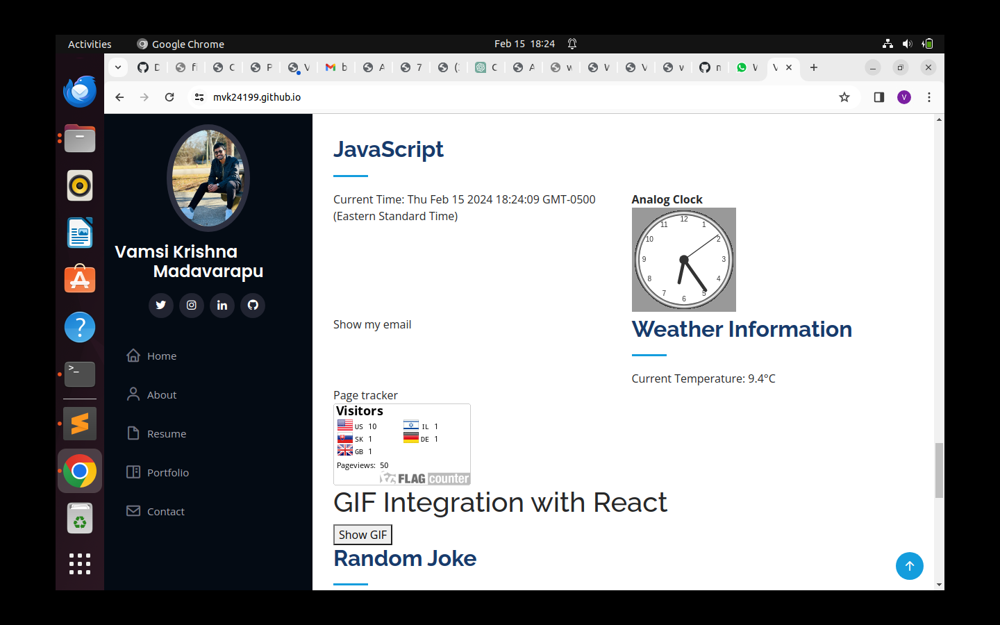
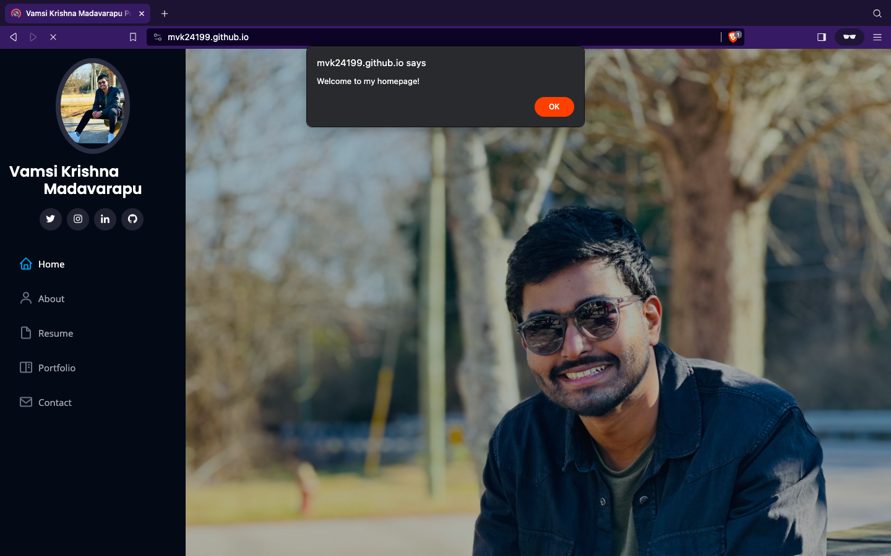
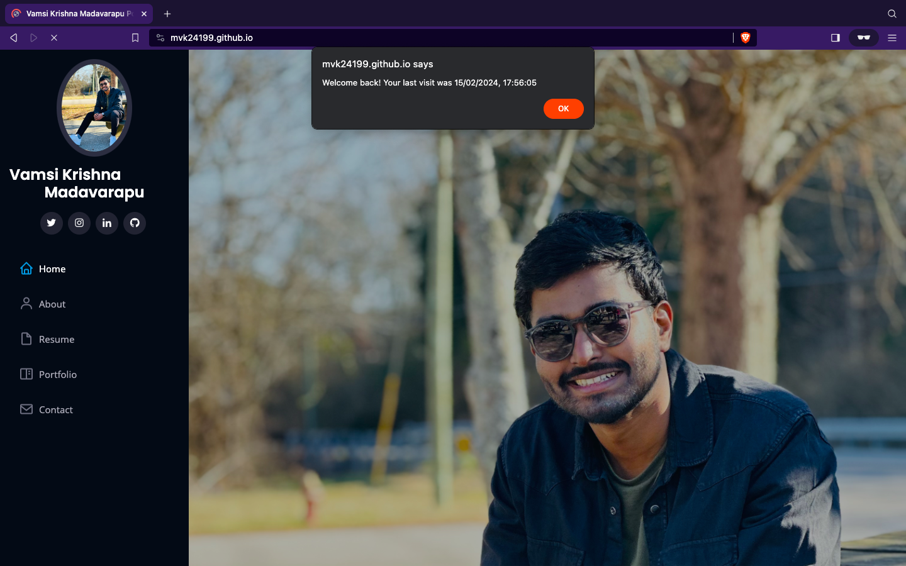
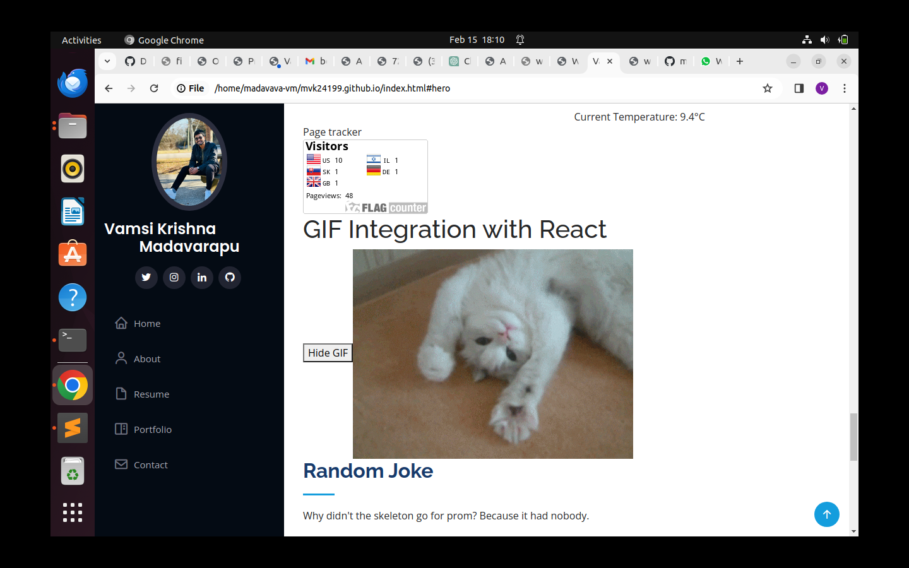

# WAPH-Web Application Programming and Hacking

## Instructor: Dr. Phu Phung

## Student name: Vamsi Krishna Madavarapu

## Student mail: madavava@mail.uc.edu

{width=150px height=150px}

# Individual Project 1 - Front-end Web Development 

## Overview and Requirements 

In this project, I have used my learnings of Lecture from 1 to 6 and it covers topics ranging from HTML, CSS, Javascript, Ajax, jQuery and have used API's to retrieve the data. I have started off with a basic html file which shows my headshot, name and other info.  Later, I have reused the work I have done as part of Lab2 like show/hide functionality for email, Displaying analog and digital clock and a JS code to view/display Gif. Later I have integrated my index.html file with the api's like JOkeAPI and Weatherbit api. In addition to that, I have enabled cookies in my index.html using Javascript to make sure that the user logging in receives a welcome if it's their first visit to the page and receives a Welcome back message followed by the last viewed timestamp if they are revisiting the page.

I have uploaded the code in my private repository [https://github.com/mvk24199/mvk24199.github.io](https://github.com/mvk24199/mvk24199.github.io)

### Task 1: Setup github.io

In this task, I have created a repository in github with the naming convention suggested by professor like mvk24199.github.io and later I have made it public. Next, I have created a index.html file with a headshot of my image and few basic HTML headings and later on as per the video lecture 6, I have cloned my mvk24199.github.io repository into my local workspace and later created waph.html. I have copied the code of my lab2 into index.html file. 

#### a.Repository Creation and cloning:
   In the initial step, you followed your professor's suggestion and created a repository on GitHub with the specific naming convention "mvk24199.github.io." This naming convention is crucial for GitHub Pages to recognize it as a personal website. By adhering to this convention, you set the foundation for hosting your site on GitHub.

   Subsequently, you made your GitHub repository public. This step is essential for making your website accessible to the public. By changing the repository's visibility to public, you allowed anyone to view your site and its content, aligning with the purpose of GitHub Pages as a platform for sharing and showcasing projects.

   With the repository set up, you began creating the content for your website. The initial step involved crafting an "index.html" file. In this file, you incorporated a headshot of yourself along with basic HTML headings. This marks the starting point for the visual and structural components of your website.

   To work on your website locally and make changes offline, you cloned your "mvk24199.github.io" repository into your local workspace. This enables you to experiment with the website's structure, style, and content before pushing the changes to the online repository. Cloning ensures a seamless workflow between your local development environment and the GitHub repository.

   Following the guidance from a video lecture (Lecture 6), you expanded the content of your website by creating an additional HTML file named "waph.html." This file became a space for implementing more advanced features, possibly integrating lessons learned in the lecture. By having separate HTML files, you organized your content effectively and set the stage for building a more comprehensive and dynamic website.

####  b. Bootstrap

Professor has suggested to use Bootstrap as part of this assignment and in order to do that I have searched for free bootstrap themes online and selected one of the theme and modified it according to my requirement. In addition to that, I have downloaded bootstrap from the official website and included it in my html file. I have used my resume in pdf format and created multiple divs and subpages to align my resume within the website. In addition to that, I have used the css to add forms with div,images in a frames,etc..

#### c. Javascript

As a continuation from lab2, I have used some functionalities like Analog Clock display, digital clock and Show/hide email functionality. In addition to that, I have used API's concept and integrated JokesAPI and Weatherbit api in the index.html file. The JokesAPI randomly displays a joke for every 1 min and Weatherbit api displays the weather conditions of a particular location.

The Weatherbit API is a public API and in order to use that we have to generate API key which will be unique for each user and include it within the code for effective use. The JokesAPI doesn't use any API Key for instance but displays a random joke.

Flag counter website is integrated into index.html and it is a free counter that adds a new country flag whenever someone new views the page. 

Cookies are enabled internally within the website and the main motto behind that is let the users know that they have visited this page already at a particular timestamp. Initially when a user visits the page it displays a Welcome message and whenever a user revisits the same site it displays a message "welcome back" followed by the previous timestamp. For better usablilty, the lifepeiod of cookies is set to 30 days.

In addition to that, I have intergrated a gif in my website using react js and the button has two options to hide/show the gif. Whenever user click on show gif, it displays the gif in a frame and later it provides a hide gif button using which the gif screen can be minimized.

